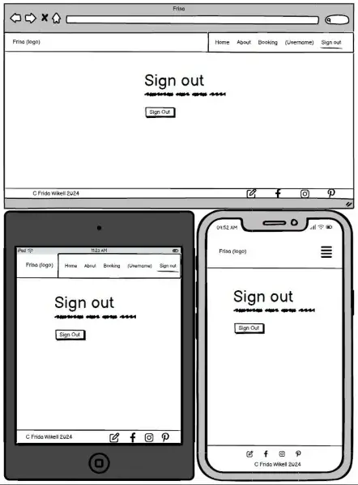
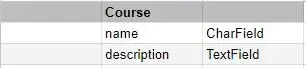
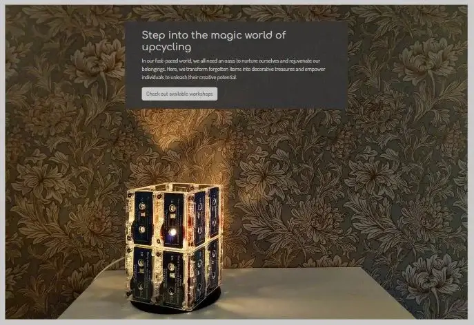
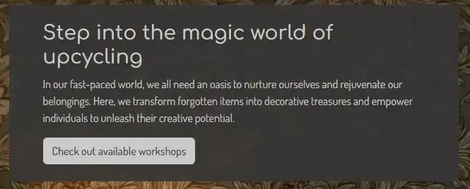
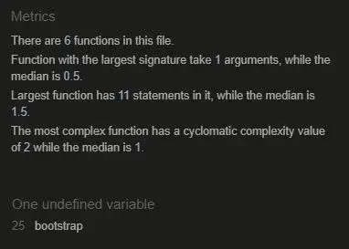

# Frisa Booking

## Introduction
The project is to build a website where you as a user can book a workshop to upcycle old things. If the user doesn't visit the website with the goal to book a workshop right away, the website should work as an inspiration.

## Table of Contents
[[_TOC_]]

## User Experience
### User Stories
- User Goals
- Site Owner Goals

## Design
The design is set to be modern but easy to read. It should draw the attention to the images which will enhance the chance to get the users to get inspired. The design should feel welcoming and like you're visiting a friends place. 

### Color Scheme
The color scheme is set to feel modern and harmonize with the hero image. Any bright colors in the scheme were avoided due to not draw any attention from the images at the website. The colors are reused on all pages to make every page feel familiar and to enhance the feeling that the website is an unity. 

### Typography
The typography were chosen to have a modern touch. They were chosen to feel easygoing and fun, but at the same time easy to read. The text was designed to incorporate some spacing, ensuring it doesn't appear as a dense block of text upon opening a page. The written communication across the website adopts a playful tone to foster a friendly atmosphere. Emojis was added to make the tone more playful and friendly.  

### Imagery
All the images are chosen to inspire the website users. The images should give a warm feeling with the help of the content and a warm tone in them. The images have been designed with a playful and dynamic excerpt to encourage user engagement and increase sign-ups for the workshop. The objects on the images are things that has been made by the leader of the workshops. In other words, they are objects that you can do at the workshops!

### Wireframes

#### Index page

#### About page

#### Booking page

#### My bookings page

#### Success page

#### Edit booking page

#### Sign up page

#### Sign in page

#### Sign out page

#### 404 page

#### 500 page

### Entity Relationship Diagram - ERD

Three different models were used in the website.

## Features

### Header

#### Navigation bar

The navigation bar makes it easy for the user to navigate at the site. It takes the user directly to the home page, about page, booking page, sign in page and sign up page. This helps the user to get a overview of the website.

#### Navigation bar (as a logged in user)

The navigation bar for a logged in user is almost the same as the not logged in user. The main difference is that the sign in and sign up links are replaced with the users username and sign out links. The users username is linking to the page where the user can see their bookings. 

#### Navigation bar (as a staff member or superuser)

The navigation bar for a logged in staff member or superuser adds another link which links to the News page. This page is only accessible for staff members and superusers.

### Index page

#### Hero image

The hero image is an eyecatching image selected to get the user to feel "wow, I want to do that aswell". It's selected to get the user to feel the inspiration flow. The warm tones in the images are there to get a warm and welcoming feeling.

#### Welcome text

At the hero image, the welcome text is presented. The text has a darker background which makes it easier for the user to read. The text is there to welcome the user and present a short description of what they can expect of the website. After the text, a button which links to the booking page, is present. It has a lighter color which makes it pop from the background. This presents and directs the user to the main purpose of the website.

#### Members benefit

A motivational text of why the user should sign up and become a member is supposed to get the user to sign up. If the user isn't convinced, two lists are present of what you get as a member and what you miss out on. 

#### Sign up button

If the user is visiting the index page without beeing signed in, a sign up page is present below the member benefits. This to make it easy for the user to sign up when they have read the fantastic benefits. 

#### Carousel

At the bottom of the index page, a carousel with images are located. This carousel is there to present several more objects that can me done at the workshops. Their goal is to inspire users and increase their interest in registering for the workshops. The start image is an image with a text on it to get the user to start looking at the images.

### About page

#### Profile image

The profile image presents the founder and owner of Frisa. To show who it is makes the user to feel closer and get a more friendly feeling when they may fill out the contact form or sign up to a workshop. 

#### About text

The text is a compliment to the profile image to present the founder and owner of Frisa. It will help to enhance the friendly feeling. This will also help the user to know what to expect from the webpage.

#### Contact form

The contact form is a channel for the user to get in contact if they have any questions. The text on top of the contact form encourage the user to reach out to the site owner.

### Booking page

#### Workshop presentation

The three different workshops are presented with a informative text. Each presentation has a read more button so the user can read more if they are interested. The read more button is also there to avoid that the user is met by a wall of text when they are visiting the booking page.

#### Workshop booking

The booking section of the page presents the availible workshop sessions. Each session is presented with the name of the workshop, date, time and how many availible spots that are left. Each session is represented as a button where the user can click on the button to book the section.

#### Booking pagination

Below the booking section a pagination is present if the availible workshops are more than eight. This is to enhance the user experience to avoid scrolling in an eternity.

#### Confirm booking modal

A confirmation modal is triggered when the user has pressed a booking button. The confirmation modal gives the opportunity to the user to confirm the booking or cancel the confirmation modal without making any booking. The confirm button is green and cancel button is red to enhance the meaning of the buttons.

#### Double booked modal

A double booking modal is triggered when the user tries to book a workshop session that they already has a booking at. This is to avoid that the user books the workshop session several times.

### Success page

#### Confirmation text

After a successful booking, a text that confirms the booking appears. This is to confirm that everything went just fine with the booking. The text is also supposed to give the user a fun welcome to the upcoming workshop.

#### Navigation buttons

Under the confirmation text, three navigation buttons are visible; "View my bookings", "Home" and "Book another workshop". On smaller devices, only "View my bookings" and "Book another workshop" are visible. These buttons are there to make the user to stay at the website after a successful booking.

### My bookings page

#### No bookings - text

When the user doesn't have any active bookings, a text informs the user about it. The text informs the user where they can find the booking page.

#### No bookings - button

When the user click on the button, they get directed to the booking page. This to have the user to make a booking.

#### Active bookings - text

When the user have at least one booking, the user gets a text that informs that all their booked sessions are presented below. The text is also supposed to get the user to have a small giggle and get excited for upcoming workshops.

#### Active bookings - booked workshops

The users bookings are presented with the workshop that is next in time appears first. Each booked workshop card has an Edit button and one Cancel button. When the Edit button is pressed, the user gets directed to the edit page. When the Cancel button is pressed, a confirmation modal is triggered. These two buttons allows the user to edit and delete the booked session if the user has to change their plans.

#### Active bookings pagination

If the user has more than four active bookings, a pagination appears below the active bookings. This is to enhance the user experience, to make it easier for the user to see their active bookings.

#### Confirm cancellation modal

When the user press the Cancel button in their active booking, a confirm cancellation modal is triggered. This is to make sure the user didn't press Cancel by mistake. The Confirm button in the modal is red to mark that if you press it, something that is irreversible.

### Edit booking page

#### Availible workshops

All availible workshops are presented in a similar way as on the booking page. The title of the workshop, date, time and availible spots are presented. The similarity should make the user to recognize the how to book a workshop session. When the user clicks the workshop they want to change their booking to, a confirmation modal is triggered.

#### Availible workshops pagination

If it is more than eight availible workshops to select from, pagination is present. This to enhance the user experience, to avoid to scroll through a wall of availible workshops.

#### Confirm workshop change modal

The confirmation modal ensures that the user wants to edit their booking to the selected workshop session. This to avoid the user edit their booking to a session they didn't want to. The text is written in a way that should enhance the users feeling that this is a friendly and fun website.

### News page

The news page is only visible for staff members and supersers. Through the admin panel all staff members and superusers can write news what happened at their last workshop. The name of the workshops are located below the header. The members who was written it and when it is published are located at the bottom of section.

### Sign up page

The sign up page have fields where the user is required to fill out email, username, password and password again. This to make sure the user doesn't get a typo in the password and to ensure the user register a way to contact them.

### Sign in page

The sign in page allows the user who already has an account to sign in. This to make the user experience smoother where they don't have to fill out their email every time they want to make a booking. It is also an advantage that the user can see all their bookings.

### Sign out page

The sign out page allows the user to sign out to ensure no one else can edit the users booking. The sign out button ensures the user really wanted to sign out and didn't press on Sign out by mistake.

### 404 page

![]

### 500 page

The 500 page explains to the user that the server isn't working as intended. It suggest the user what they can do, refresh the page, go back to the homepage or send the website owner an email. The suggestion about going back to the homepage is provided with a link to the homepage. The suggestion about sending an email is provided with a link to the contact form.

### Footer

To the left, the developers name is to tell the world who the brain behind the website is. To the right, four symbols represent what they link to. The first, the pen, links the user to the Contact form at the about page. The second, Facebook icon, links the user to Facebook in a new tab. The third, Instagram icon, links the user to Instagram page in a new tab. The fourth, Pinterest icon, links the Pinterest in a new tab.

## Features to be Added

Several features can be added in the future.

- Select if you as a user want to have notification some days before it is time for the workshop.
- Be able to select how many spots you want to book at each workshop.
- Include an online shop were you could buy some upcycled things made by the owner.
- Implement a review section where the users who has been at the workshops can leave reviews.
- Sign in with Social media account or Google credentials.
- Captcha verification when the user is signing up with email address.
- Guidance when a user sign in for the first time.

## Testing

### Validation of Code

#### HTML

All the pages were tested at the [W3C Markup Validation Service](https://validator.w3.org/). The index page validation is presented above, all the other validations are linked below.

- [About page](doc/about-html-valid.webp)
- [Booking page](doc/booking-html-valid.webp)
- [My bookings](doc/my-bookings-html-valid.webp)
- [News page](doc/news-html-valid.webp)
- [Edit booking](doc/edit-booking-html-valid.webp)
- [Success page](doc/success-html-valid.webp)
- [400 page]()
- [500 page](doc/500-page-html-valid.webp)

INSERT 400 PAGE!!!!

#### CSS

The CSS code was tested at [W3C CSS Validation Service](https://jigsaw.w3.org/css-validator/). It resulted without any errors but with one warning. The warning was "Imported style sheets are not checked in direct input and file upload modes" which refers to the fonts which are imported from Google fonts.

#### JavaScript

All three JavaScript files were validated through [JSHint](https://jshint.com/). The validation rendered without errors. In two of the files, Booking and Edit Booking, one undefined variable was discovered. This undefined variable was bootstrap. This variable originates from the Bootstrap framework and is thus declared in its documentation.

**Booking page**

**Edit booking page**

**Delete booking**

#### Python

All Python files have been validated through [CI Python Linter](https://pep8ci.herokuapp.com/) to make sure the code meet the standards of PEP8. The validation resulted without errors.

**Bookings - views.py**

**About - views.py**

**News - views.py**

- [Python validation of models.py in bookings](doc/pep8-booking-models.webp)
- [Python validation of admin.py in news](doc/pep8-news-admin.webp)
- [Python validation of models.py in news](doc/pep8-news-models.webp)

### Lighthouse
You can perform a test of your website for performance, accessibility, best practices and SEO through the google chrome lighthouse test - it is in your Dev tools. Bear in mind that your internet connection speed plays a part in the performance figures obtained. Where it scores low, it will give you suggestions on how to improve the site - read the suggestions and think about how to implement them - it could be a good idea.
Do this for both Desktop and Mobile.

### Wave Webaim - accessibility testing

The accessibility test at [Wave Webaim](https://wave.webaim.org/) resulted without both errors and contrast errors on all pages.

**Index page**

**About page**

**Booking page**

### Contrast Grid

The [Contrast Grid](https://contrast-grid.eightshapes.com/?version=1.1.0&background-colors=&foreground-colors=%23CACACA%2C%20%20Background%20color%0D%0A%23353535%2C%20Text%0D%0A%23411919%2C%20Cancel%20btn%20-%20background%0D%0A%23FFFFFF%2C%20Cancel%2Fconfirm%2Fdelete%20btn%20-%20text%0D%0A%23193A18%2C%20Confirm%20btn%20-%20background%0D%0A%238d3838%2C%20Delete%20btn%20-%20background%0D%0A%23000000%2C%20Footer%20icons&es-color-form__tile-size=compact&es-color-form__show-contrast=aaa&es-color-form__show-contrast=aa&es-color-form__show-contrast=aa18&es-color-form__show-contrast=dnp) resulted in only AAA results for the combination used on the webpage. The main combination throughout the page is #CACACA and #353535 which has a value of 7.4 (where the limit for AAA is 7+).

### Automated Testing

Automated testing is made for all three different apps (about, booking and news). Totally 33 tests were made divided into 8 tests in about, 12 tests in booking and 13 tests in news.

**About**

- [Test of forms.py](about/tests_forms.py)
- [Test of views.py](about/tests_views.py)

**Booking**

- [Test of models.py](booking/tests_models.py)
- [Test of views.py](booking/tests_views.py)

**News**

- [Tests of admin.py](news/tests_admin.py)
- [Tests of models.py](news/tests_models.py)
- [Tests of views.py](news/tests_views.py)

### Manual Testing

You need to perform, and document everything you did to manually test your site.
At a minimum - you need to check every link on every page works as intended.
So that is check every link in the nav bar (do this on every single page because its a link in a different file) and any other links that appear on your site.
Test the responsiveness of the site - you can do this in the dev tools in responsive mode.
You should also load the site once deployed on as many devices you have access to. What is different from one device to the next? why is it different?

Test the user stories that you created earlier in the readme - did you satisfy the goal, how?

Every page at the website has been manually tested. It is done in Google Chrome DevTools and on different devices. The devices used were one mobile phone, one laptop and one external screen:

- Samsung Galaxy A52s (1080 x 2400)
- HP 250 G4 Notebook PC (1366 x 768)
- HP 2309v LCD Screen (1920 x 1080)

#### Navigation bar

| Feature being tested | Expected Outcome | Testing Performed | Actual Outcome | Result (Pass or fail) |
| -------------------- | ---------------- | ----------------- | -------------- | --------------------- |
| Home link | When clicked, direct the user to the home page | Click at "Home" | Got directed to the home page | Pass |
| About link | When clicked, direct the user to the about page | Click at "About" | Got directed to the about page | Pass |
| Booking link | When clicked, direct the user to the booking page | Click at "Booking" | Got directed to the booking page | Pass |
| Sign up link | When clicked, direct the user to the sign up page | Click at "Sign up" | Got directed to the sign up page | Pass |
| Sign in link | When clicked, direct the user to the sign in page | Click at "Sign in" | Got directed to the sign in page | Pass |
| News link not visible (signed out) | News link not visible as a signed out user | Sign out and inspect navigation bar | News link not visible | Pass |
| News link not visible (signed in user - regular) | News link not visible as a signed in user (without staff or superuser credentials) | Sign in as a regular user, check navigation bar | News link not visible | Pass |
| News link visible (signed in user - staff or superuser) | News link visible as a signed in user (with staff or superuser credentials) | Sign in as staff or superuser, check navigation bar | News link visible | Pass |
| News link | When clicked, direct the signed in user (staff or superuser) to the news page | Sign in as a staff or superuser, click at "News" | Got directed to the news page | Pass |
| My bookings link not visible | My bookings link not visible as a signed out user | Sign out and inspect navigation bar | My bookings link not visible | Pass |
| Me bookings link visible | My bookings link visible as a signed in user | Sign in, check navigation bar | My bookings link visible | Pass |
| Username showing (signed in user) | When the user is signed in, the username is presented as the link to my bookings | Sign in, check navigation bar | Username is showing | Pass |
| My bookings link | When clicked, direct the signed in user to my bookings page | Click at username | Got directed to the my bookings page | Pass |
| Sign out link | When clicked, direct the user to the sign out page | Click at "Sign out" | Got directed to the sign out page | Pass |

#### Index page

| Feature being tested | Expected Outcome | Testing Performed | Actual Outcome | Result (Pass or fail) |
| -------------------- | ---------------- | ----------------- | -------------- | --------------------- |
| Responsive design | The page changes so the content fit at the smallest to the largest screens without scrolling sideways | In DevTools, select the smallest device and make it larger step by step | The index page was responsive and changed depending on screen size | Pass |
| "Check out availible workshops" button | Directs the user to the Booking page | Click at the "Check out availible workshops" button | Got directed to the Booking page | Pass |
| Text readability | Enough margins and padding to make text readable | Read all text blocks in all different Bootstrap breakpoints | The text is readable at all breakpoints | Pass |
| Sign up button visible (not signed in) | The sign up button below member benefits is visible when the user isn't signed in | Sign out and check below member benefits | Sign up button is visible | Pass |
| Sign up button not visible (signed in) | The sign up button below member benefits is not visible when the user is signed in | Sign in and check below member benefits | Sign up button isn't visible | Pass |
| Text at image carousel | The text at the image carousel is readable | Read the text at all Bootstrap breakpoints | The text is readable | Pass |
| Start image in carousel | Start image is always the one with "Fancy some inspiration" text | Browse through the image carousel and leave it at different images before refreshing the page | The carousel always begins at "Fancy som inspiration" image | Pass |
| Image carousel never stops | The carousel doesn't has a stop, when all images are showed it starts over again | Browse through all images at both directions | When the last image is shown, the first image appears when the next arrow is pressed | Pass | 

#### About page
		
| Feature being tested | Expected Outcome | Testing Performed | Actual Outcome | Result (Pass or fail) |
| -------------------- | ---------------- | ----------------- | -------------- | --------------------- |
| Responsive design | The page changes so the content fit at the smallest to the largest screens without scrolling sideways | In DevTools, select the smallest device and make it larger step by step | The about page was responsive and changed depending on screen size | Pass |
| Text readability | Enough margins and padding to make text readable | Read all text blocks in all different Bootstrap breakpoints | The text is readable at all breakpoints | Pass |
| Contact form validation | A message appears if the user doesn't fill out all fields | Fill out all fields except one, let all different fields (First name, Last name, Email and Message) be the empty field one by one | A message appears when a field is left empty | Pass |
| Contact form response | Response appears, confirming to the user that the form has been sent | Fill out the form with valid inputs and press Submit | The contact form changed into a message confirming that the message has been sent | Pass |
| Contact form message recieved | The submitted form are sent to selected inbox in Mailtrap | Fill out the form with valid inputs and press Submit, log in to Mailtrap and view selected inbox | The message from the contact form are sent to Mailtrap | Pass |

#### Booking page
		
| Feature being tested | Expected Outcome | Testing Performed | Actual Outcome | Result (Pass or fail) |
| -------------------- | ---------------- | ----------------- | -------------- | --------------------- |
| Responsive design | The page changes so the content fit at the smallest to the largest screens without scrolling sideways | In DevTools, select the smallest device and make it larger step by step | The booking page was responsive and changed depending on screen size | Pass |
| Text readability | Enough margins and padding to make text readable | Read all text blocks in all different Bootstrap breakpoints | The text is readable at all breakpoints | Pass |
| Read more button - Perler beads | The text about Perler beads workshop expands and show more text when the "Read more" button is pressed | Press "Read more" in the Perler beads card | The text expanded and showed more text | Pass |
| Read less button - Perler beads | The expanded text about Perler beads workshop goes back to "normal" when the "Read less" button is pressed | Press "Read less" in the Perler beads card | The text collpsed and went back to normal | Pass |
| Read more button - Transforming treasures | The text about Transforming treasures workshop expands and show more text when the "Read more" button is pressed | Press "Read more" in the Transforming treasures card | The text expanded and showed more text | Pass |
| Read less button - Transforming treasures | The expanded text about Transforming treasures workshop goes back to "normal" when the "Read less" button is pressed | Press "Read less" in the Transforming treasures card | The text collpsed and went back to normal | Pass |
| Read more button - Our ultimate crafting experience | The text about Our ultimate crafting experience workshop expands and show more text when the "Read more" button is pressed | Press "Read more" in the Our ultimate crafting experience card | The text expanded and showed more text | Pass |
| Read less button - Our ultimate crafting experience | The expanded text about Our ultimate crafting experience workshop goes back to "normal" when the "Read less" button is pressed | Press "Read less" in the Our ultimate crafting experience card | The text collpsed and went back to normal | Pass |
| Booking buttons - trigger modal | When a booking button is pressed, a confirmation modal is triggered | Click all booking buttons | All booking buttons triggered a confirmation modal | Pass |
| Confirmation modal - X | When the X at the confirmation modal is pressed, the modal is closed without making any booking | Trigger confirmation modal, press X | The modal closed without making any booking | Pass |
| Confirmation modal - Close | When the "Close" button at the confirmation modal is pressed, the modal is closed without making any booking | Trigger confirmation modal, press "Close" | The modal closed without making any booking | Pass |
| Confirmation modal - outside modal | When the user click anywhere outside of the confirmation modal, it is closed without making any booking | Trigger confirmation modal, click somewhere outside of the modal | The modal closed without making any booking | Pass |
| Confirmation modal - Confirm | When the "Confirm" button is pressed, a booking is made | Press "Confirm", check "My bookings" if a booking has been made | A booking was made | Pass |
| Confirmation modal - Confirm | When the "Confirm" button is pressed, the user gets redirected to Success page | Press "Confirm" | The user got directed to the Success page | Pass |
| Pagination | When it is more than eight upcoming workshops, pagination appears | Scroll down below active bookings buttons | After eight bookings, pagination buttons appears | Pass |
| Pagination - stay at bookings buttons section | When you change between the pages of active booking buttons, you come to the top of the booking buttons | Change page using pagination | When next button is pressed, the second page is showed and scrolled to the top of booking buttons | Pass |
| Double booking modal | When a user tries to book a workshop session they already has a booking at, a Booking notice modal is triggered | Try to book a workshop were an active booking already exist | A modal is triggered when the user tries to double book | Pass |
| Double booking modal - X | When the X at the double booking modal is pressed, the modal is closed without making any booking | Trigger double booking modal, press X | The modal closed without making any booking | Pass |
| Double booking modal - Close | When the "Close" button at the double booking modal is pressed, the modal is closed without making any booking | Trigger double booking modal, press "Close" | The modal closed without making any booking | Pass |

#### Success page

| Feature being tested | Expected Outcome | Testing Performed | Actual Outcome | Result (Pass or fail) |
| -------------------- | ---------------- | ----------------- | -------------- | --------------------- |
| Responsive design | The page changes so the content fit at the smallest to the largest screens without scrolling sideways | In DevTools, select the smallest device and make it larger step by step | The booking page was responsive and changed depending on screen size | Pass |
| Text readability | Enough margins and padding to make text readable | Read all text blocks in all different Bootstrap breakpoints | The text is readable at all breakpoints | Pass |
| View my bookings button | The "View my bookings" button directs the user to My bookings page | Click at "View my bookings" button | The user got directed to the My bookings page | Pass |
| Book another workshop button | The "Book another workshop" button directs the user to Bookings page - booking buttons section | Click at "Book another workshop" | The user got directed to the Booking page, booking button section | Pass |
| Home button - not visible | On devices smaller than 768px (breakpoint below medium in Bootstrap), the "Home" button is not visible | Select breakpoints smaller than medium and view the page | The "Home" button is not visible | Pass |
| Home button - visible | On devices with 768px or larger (breakpoint medium or larger in Bootstrap), the "Home" button is visible | Select medium breakpoint and view the page | The "Home" button is visible | Pass |

#### My bookings page

| Feature being tested | Expected Outcome | Testing Performed | Actual Outcome | Result (Pass or fail) |
| -------------------- | ---------------- | ----------------- | -------------- | --------------------- |
| Responsive design | The page changes so the content fit at the smallest to the largest screens without scrolling sideways | In DevTools, select the smallest device and make it larger step by step | The booking page was responsive and changed depending on screen size | Pass |
| Text readability | Enough margins and padding to make text readable | Read all text blocks in all different Bootstrap breakpoints | The text is readable at all breakpoints | Pass |
| Username in text | In the first sentence, the username is presented | Sign in and compare the username with the presented name | The username and the presented name is equal | Pass |
| Active bookings | All of the users active bookings are presented | Compare active bookings in the admin panel to the presented active bookings | The active bookings are the same in the admin panel as presented at the My bookings page | Pass |
| Edit button | When the "Edit" button is pressed, the user gets directed to Edit booking page | Press "Edit" button | The user got directed to the Edit booking page | Pass |
| Cancel button | When the "Cancel" button is pressed, a confirmation modal is triggered | Press "Cancel" button | A confirmation modal is triggered | Pass |
| Confirmation modal - X | When the X at the confirmation modal is pressed, the modal is closed without cancelling the booking | Trigger confirmation modal, press X | The modal closed without cancelling the booking | Pass |
| Confirmation modal - Close | When the "Close" button at the confirmation modal is pressed, the modal is closed without cancelling the booking | Trigger confirmation modal, press "Close" | The modal closed without cancelling the booking | Pass |
| Confirmation modal - outside modal | When the user click anywhere outside of the confirmation modal, it is closed without cancelling the booking | Trigger confirmation modal, click somewhere outside of the modal | The modal closed without cancelling the booking | Pass |
| Confirmation modal - Confirm | When the "Confirm" button is pressed, the booking is cancelled | Press "Confirm", check "My bookings" if the booking has been cancelled | The booking was cancelled | Pass |
| Availible spots increase | When a booking is cancelled, availible spots are increased by one | Check availible spots at an already booked workshop, cancel the booking and check availible spots again | Availible spots increased by one | Pass |
| Pagination | When it is more than four upcoming workshops, pagination appears | Scroll down below my bookings buttons | After four bookings, pagination buttons appears | Pass |
| No bookings - text | Another text than the text which appears when the user has active bookings appears | Cancel all the users bookings | Another text appeared | Pass |
| No bookings - Take me there button | The "Take me there" button directs the user to the booking page | Click "Take me there" button | The user got directed to the bookings page | Pass |

#### Edit booking page

| Feature being tested | Expected Outcome | Testing Performed | Actual Outcome | Result (Pass or fail) |
| -------------------- | ---------------- | ----------------- | -------------- | --------------------- |
| Responsive design | The page changes so the content fit at the smallest to the largest screens without scrolling sideways | In DevTools, select the smallest device and make it larger step by step | The booking page was responsive and changed depending on screen size | Pass |
| Text readability | Enough margins and padding to make text readable | Read all text blocks in all different Bootstrap breakpoints | The text is readable at all breakpoints | Pass |
| Availible workshop sessions | Only sessions where the user doesn't already has an active booking is shown | Compare upcoming workshops, the users active bookings and the availible sessions in edit booking | Only sessions where the user doesn't has an active bookings are visible | Pass |
| Booking buttons - trigger modal | When a booking button is pressed, a confirmation modal is triggered | Click all booking buttons | All booking buttons triggered a confirmation modal | Pass |
| Confirmation modal - X | When the X at the confirmation modal is pressed, the modal is closed without making any booking | Trigger confirmation modal, press X | The modal closed without making any booking | Pass |
| Confirmation modal - Close | When the "Close" button at the confirmation modal is pressed, the modal is closed without making any booking | Trigger confirmation modal, press "Close" | The modal closed without making any booking | Pass |
| Confirmation modal - outside modal | When the user click anywhere outside of the confirmation modal, it is closed without making any booking | Trigger confirmation modal, click somewhere outside of the modal | The modal closed without making any booking | Pass |
| Confirmation modal - Confirm | When the "Confirm" button is pressed, the existing booking is changed to the selected workshop session | Press "Confirm", check "My bookings" if the booking has been changed | The booking was changed | Pass |
| Availible spots - increase | In the session the user cancel their booking, availible spots increases by one | Check availible spots at the session, edit the booking, check availible spots again | Availible spots increased by one | Pass |
| Availible spots - decrease | In the session the user want to change their booking to, availible spots decreases by one | Check availible spots at the session, edit the booking, check availible spots again | Availible spots decreased by one | Pass |
| Pagination | When it is more than eight availible workshops, pagination appears | Scroll down below active bookings buttons | After eight bookings, pagination buttons appears | Pass |

#### News page

| Feature being tested | Expected Outcome | Testing Performed | Actual Outcome | Result (Pass or fail) |
| -------------------- | ---------------- | ----------------- | -------------- | --------------------- |
| Responsive design | The page changes so the content fit at the smallest to the largest screens without scrolling sideways | In DevTools, select the smallest device and make it larger step by step | The booking page was responsive and changed depending on screen size | Pass |
| Text readability | Enough margins and padding to make text readable | Read all text blocks in all different Bootstrap breakpoints | The text is readable at all breakpoints | Pass |
| Color change - every other | Every other news have dark backgrounds, every other light backgrounds | Scroll through the news | Every other news has dark background, every other news has light background | Pass |

#### Sign up page

| Feature being tested | Expected Outcome | Testing Performed | Actual Outcome | Result (Pass or fail) |
| -------------------- | ---------------- | ----------------- | -------------- | --------------------- |
| Responsive design | The page changes so the content fit at the smallest to the largest screens without scrolling sideways | In DevTools, select the smallest device and make it larger step by step | The booking page was responsive and changed depending on screen size | Pass |
| Text readability | Enough margins and padding to make text readable | Read all text blocks in all different Bootstrap breakpoints | The text is readable at all breakpoints | Pass |
| All fields required | An error message appears when the user tries to sign up but leaves one field empty | Leave one field empty one by one and try to Sign Up | An error message appeared when a field was left empty | Pass |
| Redirected | When the "Sign Up" button is pressed, the user gets redirected to the page they visited before | Visit Booking page, click Sign up, fill out all required fields, press "Sign Up" button | The user got redirected to the Bookings page | Pass |

#### Sign in page

| Feature being tested | Expected Outcome | Testing Performed | Actual Outcome | Result (Pass or fail) |
| -------------------- | ---------------- | ----------------- | -------------- | --------------------- |
| Responsive design | The page changes so the content fit at the smallest to the largest screens without scrolling sideways | In DevTools, select the smallest device and make it larger step by step | The booking page was responsive and changed depending on screen size | Pass |
| Text readability | Enough margins and padding to make text readable | Read all text blocks in all different Bootstrap breakpoints | The text is readable at all breakpoints | Pass |
| All fields required | An error message appears when the user tries to sign in but leaves one field empty | Leave one field empty one by one and try to Sign In | An error message appeared when a field was left empty | Pass |
| Sign In button | When the "Sign In" button is pressed, the user gets signed in | Click at "Sign In" button | The user gets signed in | Pass |
| Redirected | When the "Sign In" button is pressed, the user gets redirected to the page they visited before | Visit Booking page, click Sign in, press "Sign In" button | The user got redirected to the Bookings page | Pass |

#### Sign out page

| Feature being tested | Expected Outcome | Testing Performed | Actual Outcome | Result (Pass or fail) |
| -------------------- | ---------------- | ----------------- | -------------- | --------------------- |
| Responsive design | The page changes so the content fit at the smallest to the largest screens without scrolling sideways | In DevTools, select the smallest device and make it larger step by step | The booking page was responsive and changed depending on screen size | Pass |
| Text readability | Enough margins and padding to make text readable | Read all text blocks in all different Bootstrap breakpoints | The text is readable at all breakpoints | Pass |
| Sign Out button | When the "Sign Out" button is pressed, the user gets signed out | Click at "Sign Out" button | The user gets signed out | Pass |
| Redirected | When the "Sign Out" button is pressed, the user gets redirected to the page they visited before | Visit Booking page, click Sign out, press "Sign Out" button | The user got redirected to the Bookings page | Pass |

#### 404 page

#### 500 page

#### Footer

You should have tests for every section of every page.. individually.

## Technologies Used

Detail what technologies you used. So what code languages, what frameworks, libraries, what software did you use to develop the site - Balsamic for your wireframes, Figma for a mockup?

## Deployment

Detail how to clone the repository, how to fork the repository - how to run the site locally and how to deploy it.

Link to deployed website: <https://frisa-booking-e7f1e4a00ea9.herokuapp.com/>

## Credits

You need to credit where you got anything for your site from.. where are the images from, are they all from the same site? where did you get the content from, if you wrote it yourself, did you fact check anywhere? did you get code from anywhere? if so, it needs to be clearly marked in both the code and the readme.

## Acknowledgements
Any special acknowledgements you'd like to leave

Back to top link to return to the top of the readme.